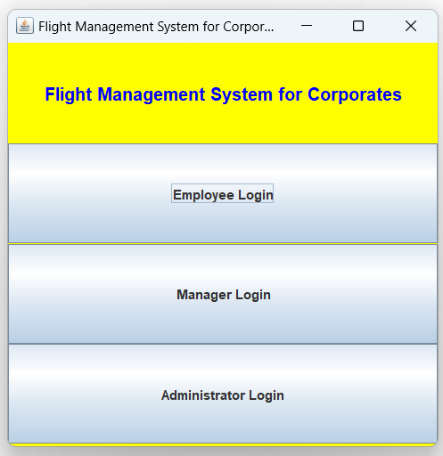

# Flight-Management-System-in-Java

## Overview
Flight Management System(FMS) is a Java-based application designed to manage flight records and employee details related to flight for companies. It provides a user-friendly GUI along with necessary CRUD operations for employee, manager and administrator.

## Technologies Used
1. [Java Swing](https://docs.oracle.com/javase/8/docs/technotes/guides/swing/index.html)
2. [Java AWT](https://docs.oracle.com/javase/8/docs/technotes/guides/awt/index.html)
3. [JDBC](https://www.oracle.com/database/technologies/appdev/jdbc-downloads.html)
4. [Intellij IDEA Community Edition](https://www.jetbrains.com/idea/download/)
5. [MySQL database](https://dev.mysql.com/downloads/installer/)
6. [mysql-connector-j-8.3.0](https://dev.mysql.com/downloads/connector/j/)

## Setup Instructions
1. Clone the Repository.
2. Open the Repository in Intellij IDEA.
3. Download and install MySQL and MySQL Connector/J.
4. Set the JDBC path as an environment variable on your PC.
5. Set up the Intellij IDEA environment:
   - Navigate to File > Project Structure > Libraries.
   - Click "+" to add the path of mysql-connector-j-8.3.0.
   - Navigate to File > Settings > Plugins.
   - Search for and install the "Database Navigator" Plugin.
6. Connect the local MySQL database with the Database Navigator Plugin and verify the connection.
7. Add all the tables in the MySQL database based on the information provided in the `database.txt` file.
8. Update the `JdbcConnector.java` file with your JDBC URL, username, and password for MySQL.
9. Run the `FlightManagementSystem.java` file by clicking on the Run button or pressing `Ctrl + F5`.

## Preview

